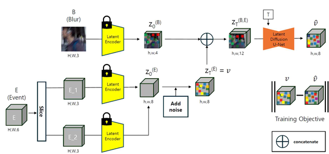
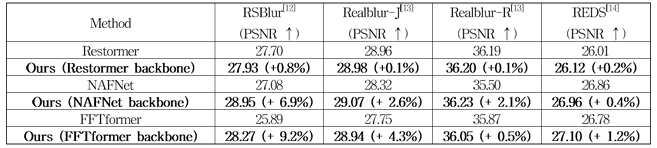
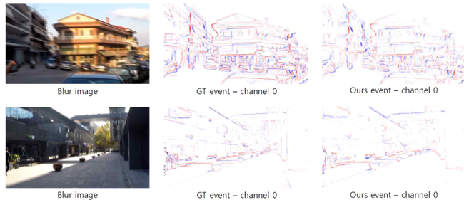
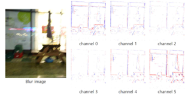
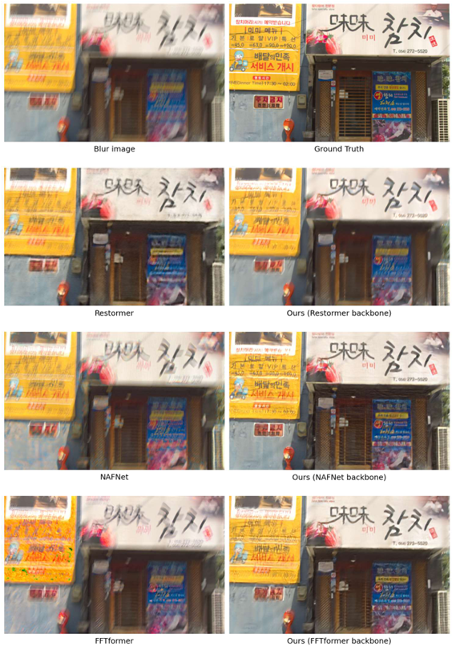
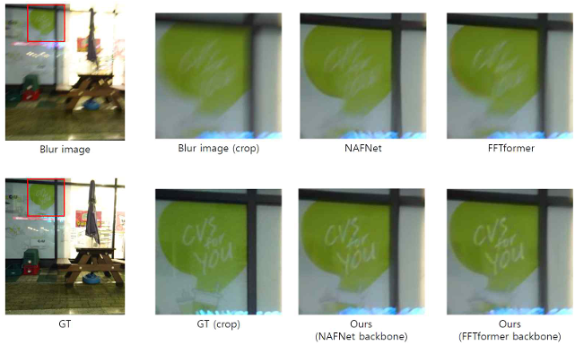

# Diffuse Blur to Event (B2E)

이 리포지토리는 한 장의 모션 블러(Motion Blur) 이미지로부터 이벤트(Event) 데이터를 생성하는 연구인 "Diffuse Blur to Event"의 구현 코드를 담고 있습니다. Diffusion Transformer (DiT) 모델을 기반으로 하여 블러 이미지에서 고품질의 이벤트 복셀(Voxel)을 복원합니다.

## 📌 주요 기능
- **Single Image to Event**: 단일 블러 이미지 입력으로 이벤트 데이터 생성
- **Stable Diffusion v2 (SDv2)기반 or Diffusion Transformer (DiT) 기반**: 고성능 생성 모델을 활용한 정밀한 이벤트 복원
- **Marigold 파이프라인 활용**: Marigold 깊이 추정 모델의 파이프라인을 이벤트 생성에 맞게 변형하여 사용

## 🏗️ 파이프라인 (Pipeline)


## 🛠️ 설치 (Installation)

### 요구 사항 (Requirements)
- Python 3.10+
- PyTorch 2.0.1
- CUDA 11.7 (권장)

### 환경 설정
필요한 라이브러리는 `requirements.txt` 또는 `environment.yaml`을 통해 설치할 수 있습니다.

**pip 사용 시:**
```bash
pip install -r requirements.txt
```

**conda 사용 시:**
```bash
conda env create -f environment.yaml
conda activate marigold
```

## 📂 데이터셋 (Dataset)
이 프로젝트는 **GOPRO 데이터셋**을 HDF5 형식으로 변환하여 사용합니다.
- 학습 및 추론 스크립트 내에서 데이터 경로가 `/workspace/data/GOPRO/train` 등으로 설정되어 있을 수 있으므로, 본인의 환경에 맞게 경로를 수정해야 합니다.
- 데이터 로더는 `dataset/h5_image_dataset.py`에 정의되어 있습니다.

## 🚀 사용법 (Usage)

### 1. 학습 (Training)
모델 학습을 위해서는 `my_train_event.py` 스크립트를 사용합니다. 설정 파일은 `config/train_dit.yaml`에 있습니다.

```bash
python my_train_event.py --config config/train_dit.yaml --output_dir output/experiment_name
```

- **주요 인자:**
  - `--config`: 학습 설정 파일 경로 (기본값: `config/train_marigold.yaml` -> `config/train_dit.yaml` 사용 권장)
  - `--output_dir`: 체크포인트 및 로그 저장 경로
  - `--resume_run`: 중단된 학습을 재개할 경우 체크포인트 경로 지정

### 2. 추론 (Inference)
학습된 모델을 사용하여 추론을 수행하려면 `inference_DIT.py`를 사용합니다.

```bash
python inference_DIT.py --checkpoint checkpoint/my_DIT --output_dir results/
```

- **주요 인자:**
  - `--checkpoint`: 학습된 모델 체크포인트 경로
  - `--dataset_name`: 데이터셋 이름 (결과 저장 폴더명으로 사용됨)
  - `--output_dir`: 결과 저장 디렉토리
  - `--denoise_steps`: 디퓨전 디노이징 스텝 수 (기본값: 50)
  - `--ensemble_size`: 앙상블 크기 (기본값: 1)

## 📊 결과 (Results)

### 정량적 지표 (Quantitative Metrics)


### 시각화 (Visualization)
#### Event Generation



#### Deblurring (Reference)



## ⚙️ 설정 (Configuration)
`config/` 디렉토리 내의 YAML 파일들을 통해 모델 및 학습 파라미터를 조정할 수 있습니다.
- `train_dit.yaml`: DiT 모델 학습을 위한 메인 설정 파일
- `model_dit.yaml`: 모델 아키텍처 관련 설정
- `dataset/`: 데이터셋 관련 설정

## 📝 구조 (Structure)
```
.
├── config/             # 학습 및 모델 설정 파일
├── dataset/            # 데이터셋 로더 및 처리 스크립트
├── src/                # 모델 소스 코드 (DiT, VAE 등)
├── my_train_event.py   # 메인 학습 스크립트
├── inference_DIT.py    # 추론 스크립트
├── requirements.txt    # 의존성 패키지 목록
└── ...
```
